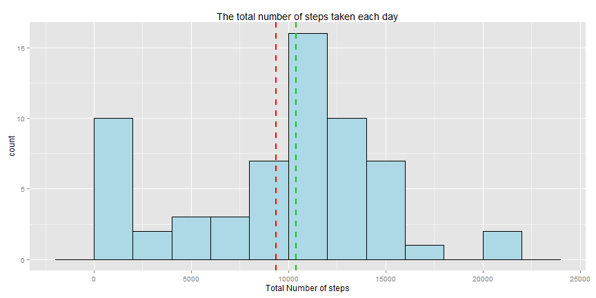
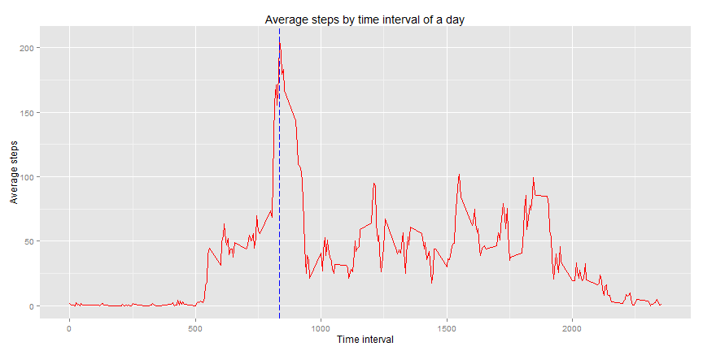
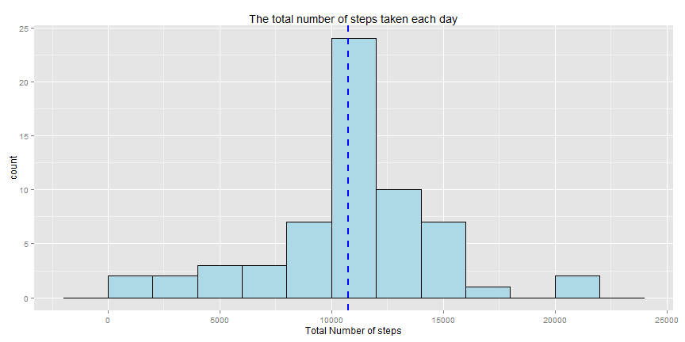
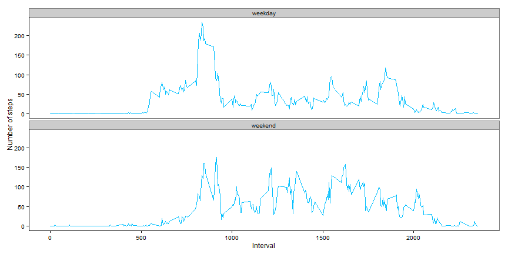

## Loading and preprocessing the data


```r
require("ggplot2")
require("plyr")

## unzip an load the data
unzip("activity.zip")
activity  <- read.csv("activity.csv", header = TRUE, sep = ",")
file.remove("activity.csv")
```

## What is mean total number of steps taken per day?

```r
## total number of steps taken per day
dailysteps <- ddply(activity, .(date), summarise, 
                total_steps = sum(steps, na.rm = TRUE))
```


 

## Mean and median of the total number of steps taken per day

```r
mean_step = round(mean(dailysteps$total_steps))
median_step = median(dailysteps$total_steps)
median_step
```

```
## [1] 10395
```

```r
mean_step
```

```
## [1] 9354
```
the **mean** (red line on histogram) is **9 354** and the **median** (green line on histogram) is **10 395**. 

## What is the average daily activity pattern?

```r
## average number of steps by interval
average_steps <- ddply(activity, .(interval), summarise, 
                  mean_steps = mean(steps, na.rm = TRUE))
```


 

### Which 5-minute interval, on average across all the days in the dataset, contains the maximum number of steps?


```r
## the maximum number of steps
max_steps = max(average_steps$mean_steps)
# the average cross interval
cross_interval = average_steps[average_steps$mean_steps == max_steps,]$interval
```
the average across interval (the blue line on the time series plot) is **835** for **206** maximum number of steps

## Imputing missing values

```r
## the total number of missing values in the dataset
total_na <- nrow(activity[is.na(activity$steps),])
```
there is **2304**  missing values in the data set.

### Filling the missing values in the data set


```r
## calcuate the mean steps for each interval
mean_interval_steps <- ddply(activity, .(interval), summarise, 
                    mean_steps = mean(steps, na.rm = TRUE))

## merge activity and interval mean steps
m <- join(x = activity, y = mean_interval_steps, by = "interval")
m[is.na(m$steps),]$steps = m[is.na(m$steps),]$mean_steps

activity2 <- m[, c(1:3)]
```

 

### Mean and median

```r
## Mean and median of the total number of steps taken per day
mean_step2 = round(mean(dailysteps2$total_steps))
median_step2 = round(median(dailysteps2$total_steps))
```
the **mean** `10 766` and the **median**  `10 766` differs from the first estimated without empty values, they have the same value because of the filling of the NA values 

## Are there differences in activity patterns between weekdays and weekends?

### Create a new factor variable in the dataset with two levels "weekday" and "weekend"


```r
days<- weekdays(as.Date(activity$date, ))
activity$day = days

weekend_flag = days=="Sunday" | days=="Saturday"

activity$type[weekend_flag] = "weekend"
activity$type[!weekend_flag] = "weekday"


activity$day = as.factor(activity$type)
activity <- activity[, c(1:4)]
```


### Plot in a time series
 
